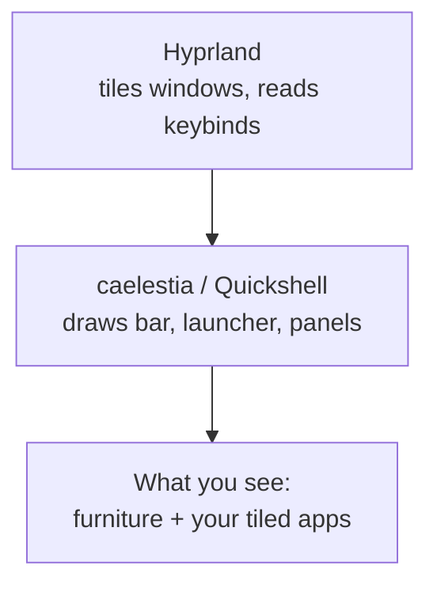
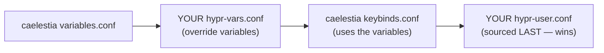

# The caelestia shell

**Goal of this page:** understand what a "desktop shell" is, what caelestia adds
on top of Hyprland, and — most importantly — the **config override model** that
keeps your customisations from being destroyed on updates. This last part is the
single most important practical rule on the whole machine.

## Window manager vs desktop shell

[Hyprland](wayland-and-hyprland.md) arranges windows, but it draws almost no
*furniture* — no taskbar, no clock, no app menu, no notification popups. A bare
Hyprland session is just your apps tiled on a wallpaper.

A **desktop shell** provides that furniture. On GNOME/KDE the shell and the
window manager ship together as one product. In the Wayland tiling world they're
separate, swappable pieces — and here the shell is **caelestia**.

caelestia is built on **Quickshell**, a toolkit for building desktop shells in
QML (a declarative UI language). caelestia provides:

- a vertical **bar** (left edge) — workspaces, clock, status,
- an app **launcher** (fuzzy search, <span class="keys">Super</span>+<span class="keys">Space</span>),
- **notifications**, a **control center** panel, wallpaper management, a color
  scheme manager, and a lock screen.



So: **Hyprland is the engine; caelestia is the dashboard.** You could remove
caelestia and Hyprland would still tile windows — you'd just have no bar.

## The golden rule: never edit the upstream tree

Here's the critical part. caelestia installs its own config into a package tree:

```
~/.local/share/caelestia/        ← caelestia's files (UPSTREAM — do not edit)
~/.config/hypr  ──symlink──▶  ~/.local/share/caelestia/hypr
```

Notice `~/.config/hypr` — the place Hyprland normally reads its config — is a
**symlink** (a pointer) into caelestia's package tree. That means:

!!! danger "The golden rule"
    **Never edit anything under `~/.local/share/caelestia/`.** When caelestia
    updates, that whole tree is overwritten — your changes would vanish. This is
    the #1 way newcomers lose work on a setup like this.

So how do you customise anything? Through an **override layer**.

## How the override model works

caelestia is designed to *source* (read in) your personal files **last**, after
its own defaults. Because Hyprland applies config top-to-bottom and "last write
wins," anything in your override file beats the default.

Your overrides live in a user-owned directory that caelestia never overwrites:

```
~/.config/caelestia/
├── hypr-vars.conf      # variable overrides (e.g. $browser = firefox)
├── hypr-user.conf      # everything else — sourced LAST, so it always wins
├── hypr-monitors*.conf # per-machine monitor config (see Displays page)
└── shell.json          # the SHELL's settings (bar, dashboard, weather, ...)
```

The `*.conf` files all configure **Hyprland** (the window manager). The shell
itself — the bar, the dashboard, the weather panel — is a separate program
(Quickshell) that reads its own settings from **`shell.json`**, covered next.

The load order is what makes it work:



Two override techniques you'll see:

1. **Override a variable.** caelestia binds <span class="keys">Super</span>+W to
   "launch `$browser`". Your `hypr-vars.conf` sets `$browser = firefox` *before*
   the bind is defined, so the existing bind silently picks up your value — no
   rebinding needed.

2. **`unbind` then `bind`.** To change a key caelestia already defined (e.g.
   <span class="keys">Super</span>+G pointed at an app you don't have), your
   `hypr-user.conf` does `unbind = Super, G` then `bind = Super, G, exec, ...`.
   Because it's sourced last, your version is the final word.

This is why the [keybinds reference](../arch/keybinds.md) keeps stressing *which file*
a bind lives in — it determines whether you override a variable or rebind a key.

## The shell's own settings: `shell.json`

The `hypr-*.conf` files tune the *window manager*. The **shell** (the bar,
dashboard, notifications, and the **weather panel**) is a Quickshell program with
a completely separate config: **`~/.config/caelestia/shell.json`**, plain JSON.
You set a key and the shell hot-reloads — no logout, no `hyprctl reload`.

The settings are grouped (`appearance`, `bar`, `background`, `services`, …). One
worth knowing: the dashboard's weather panel **defaults to Fahrenheit**. To show
**Celsius**, set `services.useFahrenheit` to `false`:

```json
{
    "services": {
        "useFahrenheit": false
    }
}
```

### The background audio visualiser

Caelestia can paint a screen-wide **audio spectrum on the wallpaper** — reactive
bars that dance to whatever's playing (a YouTube video, music, anything through
PipeWire). It's the `background.visualiser` feature, drawn by `libcava` (a *hard
dependency* of `caelestia-shell`, so the backend is always present — note it's the
**library**, not the standalone `cava` binary). It can ship **disabled by default**,
in which case nothing draws even though everything's installed. Turn it on:

```json
{
    "background": {
        "visualiser": {
            "enabled": true,
            "autoHide": true
        }
    }
}
```

`autoHide: false` keeps it visible even when a tiled window is focused (so it shows
while you're watching a video); set it `true` to only show it on an empty/floating
desktop. Other knobs under `background.visualiser`: `blur` (blur the wallpaper
behind the bars), `rounding`, `spacing`.

!!! warning "Use `autoHide: true` — `false` pins a CPU core"
    The visualiser is driven by `libcava`, which runs an **FFT + animated render
    loop**. With `autoHide: false` that loop runs **continuously** — even in
    silence and even when it's hidden behind a focused tiled window, which on a
    tiling WM is nearly always. In practice that pins quickshell (`qs`) at **~40%
    CPU on an idle desktop**, with a constant GPU draw and the fan noise/heat that
    follow. `autoHide: true` lets the loop **sleep whenever a window is focused**,
    dropping idle CPU back to low single digits; the bars still appear over an
    empty or floating desktop. That's why the `caelestia` component sets
    `autoHide: true`. It's a power/heat win, **not** a hardware-safety issue —
    transient utilisation spikes never damage modern silicon (it thermal-throttles
    long before that point) — but there's no reason to burn a core drawing bars
    nobody can see. See *Troubleshooting → the shell sits at high CPU when idle*
    below for how to diagnose and fix it by hand.

You don't normally edit these by hand — the **`caelestia` component** of
`setup-home.sh` merges both settings in for you (it deep-merges, so your other
`shell.json` keys are preserved). It **re-asserts** them on every run, so if a
caelestia update ever ships the visualiser disabled-by-default, just re-run the
component to switch it back on:

```bash
bash setup-home.sh caelestia
```

!!! tip "Discovering shell.json keys"
    The full list of settings (and their JSON paths) lives in caelestia's type
    definitions at `/usr/lib/qt6/qml/Caelestia/Config/caelestia-config.qmltypes`.
    Each config group (`ServiceConfig`, `BarConfig`, …) maps to a top-level key in
    `shell.json`. That's how `useFahrenheit` — a property of `ServiceConfig` — is
    reached as `services.useFahrenheit`.

## Theming GTK apps (and the libadwaita catch)

You'll eventually want to restyle a GTK app — say give **nautilus** (the GNOME
file manager) a different look. Two separate things are involved, and they behave
very differently:

- **Icons** are easy and global. The GTK *icon theme* is one system-wide setting
  (`gsettings set org.gnome.desktop.interface icon-theme <name>`, mirrored into
  `~/.config/gtk-{3,4}.0/settings.ini`). Install an icon set (e.g. the rainbow
  **candy-icons**, cloned from upstream — no AUR) and point that setting at it —
  nautilus and every other **GTK** app pick it up. KDE/Qt apps (System Settings,
  Okular) have their *own* icon setting, and caelestia's bar is QML, so neither is
  affected. On this machine that's the `theme` component of `install.sh` (installs
  the icons + locks the dconf key) plus the `nautilus` component of `setup-home.sh`
  (writes the `settings.ini` lines).

    !!! warning "Under Hyprland, `settings.ini` is the load-bearing part — not dconf"
        Two places hold the icon-theme name, and **which one GTK actually reads
        depends on your session**:

        - **`settings.ini`** (`gtk-icon-theme-name=…` in `~/.config/gtk-{3,4}.0/`)
          — what `setup-home.sh nautilus` writes.
        - **dconf/gsettings** (`org.gnome.desktop.interface icon-theme`) — what
          `install.sh theme` *locks* at the system level.

        On **GNOME**, the settings daemon feeds the dconf value to GTK, so the
        **dconf lock** is what makes it stick. But under a bare Wayland WM like
        **Hyprland there is no such daemon**, so **GTK4/libadwaita apps (nautilus)
        read `settings.ini`** and ignore dconf entirely. Consequence: if the
        `settings.ini` lines are missing, nautilus falls back to generic Adwaita
        folders **even with the dconf lock enforced** — the lock is real but
        nautilus never consults it. This is exactly how the icons "reset after a
        reboot": a `~/.config` rebuild dropped the `settings.ini` lines and only
        the dconf side had been re-applied. **Fix: `bash setup-home.sh nautilus`**
        (re-writes `settings.ini`; nothing in caelestia rewrites that file, so it
        persists). Run *both* components to cover GNOME and non-GNOME sessions.

    !!! tip "Icon *inheritance* — how folders and app icons combine"
        An icon theme can `Inherits=` others: a lookup falls through the chain until
        an icon is found. The **Sweet-folders** sets (`Sweet-Purple`, `Sweet-Rainbow`,
        …) ship *only folder icons* and declare `Inherits=candy-icons`. So setting
        the theme to `Sweet-Purple` yields **purple (synthwave) folders** with the
        **candy gradient app icons** for everything else — in a single setting. Pick
        a different colour with `ICON_THEME=Sweet-Rainbow bash setup-home.sh nautilus`,
        and switch back to the caelestia default (Papirus-Dark) with
        `bash uninstall.sh icons` (which keeps the packages, so re-applying is one
        command).

- **Window colours are the hard part — because of libadwaita.** Modern GNOME apps
  (nautilus included) are built with **libadwaita**, which deliberately *ignores*
  the system GTK theme **and** the `GTK_THEME` environment variable. It takes its
  colours from exactly one place: the `@define-color` rules in
  **`~/.config/gtk-4.0/gtk.css`**. On this system **caelestia writes that file**
  from its active colour scheme — so all libadwaita apps already match your
  desktop palette.

!!! warning "Why you can't theme one libadwaita app on its own"
    Because libadwaita reads colours from that single global `gtk-4.0/gtk.css`,
    there's no reliable way to give *only* nautilus a different theme. You can
    recolour **all** libadwaita apps by overwriting that palette — but it's global,
    and caelestia may rewrite the file when its scheme changes. The `GTK_THEME`
    env-var trick (and per-app `.desktop` overrides) work for plain GTK3/GTK4 apps
    but **not** for libadwaita ones. So the practical answer for "theme nautilus"
    is: change its **icons** (works), and leave window colours to caelestia.

## Who writes these override files?

You could write them by hand, but on this machine they're generated by the
**`setup-home.sh`** script — it *is* the source of truth for your overrides,
your `~/.local/bin` helper scripts, fish config, and more. The workflow is: edit
the script, re-run it, and it rewrites the files. That keeps the configuration
**reproducible** rather than a pile of hand-edits no one remembers. See
[Reproducibility](reproducibility.md).

!!! tip "Caelestia auto-reloads"
    Save an override file and caelestia's config-watcher reloads Hyprland for
    you (or run `hyprctl reload`). No logout needed for most config changes.

## Want a more conventional desktop?

A common beginner wish is a **horizontal taskbar at the bottom** like Windows.
caelestia's bar is architecturally *vertical* and has no "move to bottom" knob —
making it horizontal means forking its QML. The pragmatic path is to swap in
**waybar** (a standalone bar that does horizontal placement, pinned apps,
right-click menus) and keep the rest of caelestia. The
[Coming from Ubuntu](coming-from-ubuntu.md) guide covers this and other
"where did my Ubuntu feature go" questions in detail.

## Troubleshooting

### The shell sits at high CPU when idle (and "spikes" when panels open)

**Symptom.** Opening the dashboard, app launcher, sidebar, or the bar makes CPU,
GPU, and temps jump — and even with nothing open the machine feels busier than it
should.

**Two things are happening, and only one is worth fixing:**

1. **The on-open jump is normal and harmless.** A caelestia panel is a Quickshell
   (Qt/QML) surface with **blur/shader effects** and show animations; revealing
   it composites a new GPU surface and re-evaluates QML bindings. The dashboard
   also pulls live data (CPU/GPU/temp gauges), so showing the monitor briefly
   *reads* the system. That's a sub-second GPU burst doing exactly what it's meant
   to. **Transient spikes never damage modern silicon** — CPUs/GPUs thermal-throttle
   long before any harmful temperature, and a 1-second burst barely moves the die
   temperature. Degradation comes from *sustained* heat over years, not UI animations.

2. **The elevated *baseline* is the real bug, and it's the audio visualiser.**
   With `background.visualiser.autoHide: false`, `libcava` runs its FFT + render
   loop **continuously** — even in silence, even hidden behind a focused window —
   so quickshell (`qs`) sits around **40% CPU at idle**. The on-open spikes then
   land on top of that already-high floor, which is what makes them feel drastic.

**Diagnose it (no guessing — measure):**

```bash
# What is quickshell actually using right now?
ps -eo pid,comm,%cpu,%mem --sort=-%cpu | grep -E 'qs|caelestia'
# Its GPU footprint (NVIDIA):
nvidia-smi --query-compute-apps=pid,process_name,used_memory --format=csv | grep -i qs
```

A healthy idle shell is ~1–5% CPU. If `qs` is sitting at 30–45%, you've found it.

**Fix it by hand** — edit **`~/.config/caelestia/shell.json`** (plain JSON; this is
*your* config, not a caelestia-owned file, so it's safe to edit) and set:

```json
"background": { "visualiser": { "enabled": true, "autoHide": true } }
```

Caelestia **watches `shell.json` and hot-reloads** — no restart, no logout. Re-run
the diagnose command and `qs` should now sit in the low single digits whenever a
window is focused; the bars still appear over an empty/floating desktop.

The repo does this for you: the `caelestia` component of `setup-home.sh` asserts
`autoHide: true` (and re-asserts on every run), so `bash setup-home.sh caelestia`
applies the same fix idempotently. Prefer **no visualiser at all**? Set
`"enabled": false` for the lowest possible draw.

---

**Next:** [Displays: resolution, refresh, HDR →](displays.md) — the theory of
getting a great picture out of your monitor.
